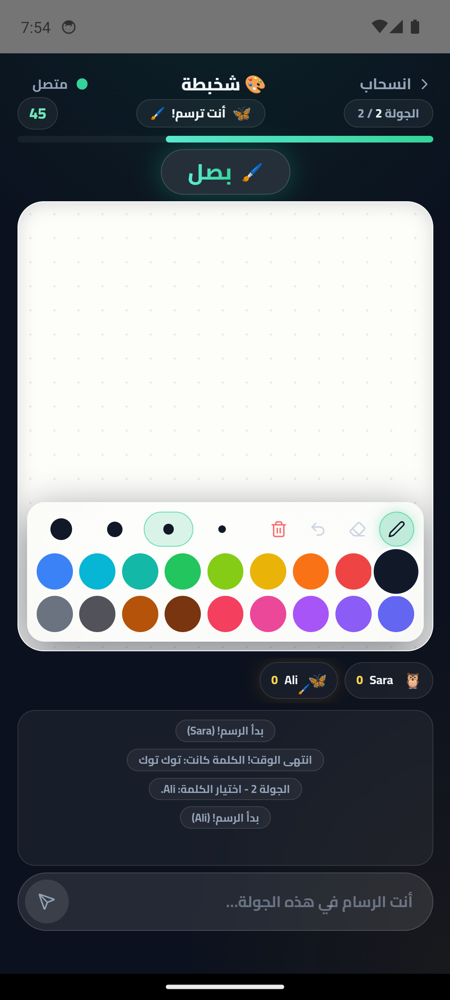
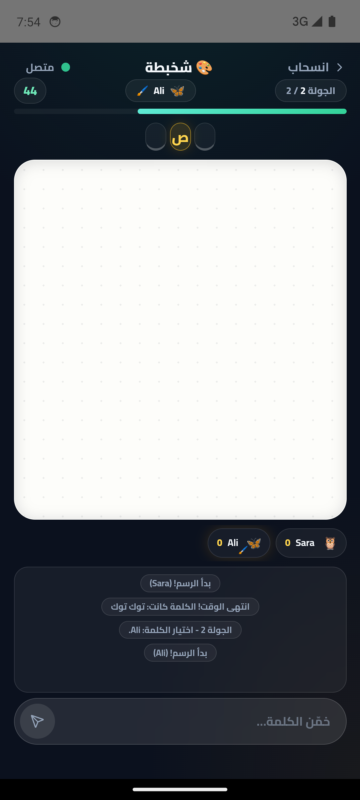
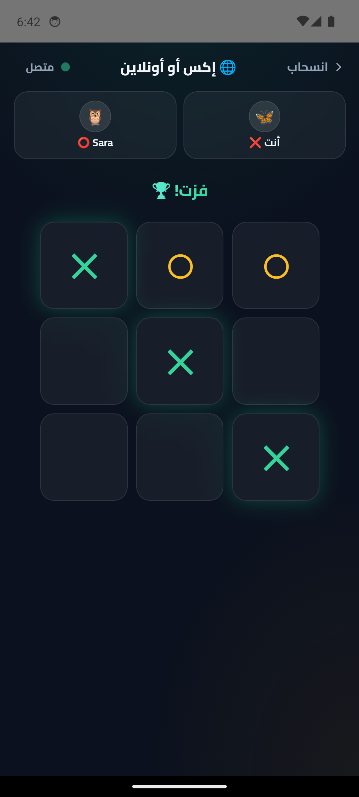
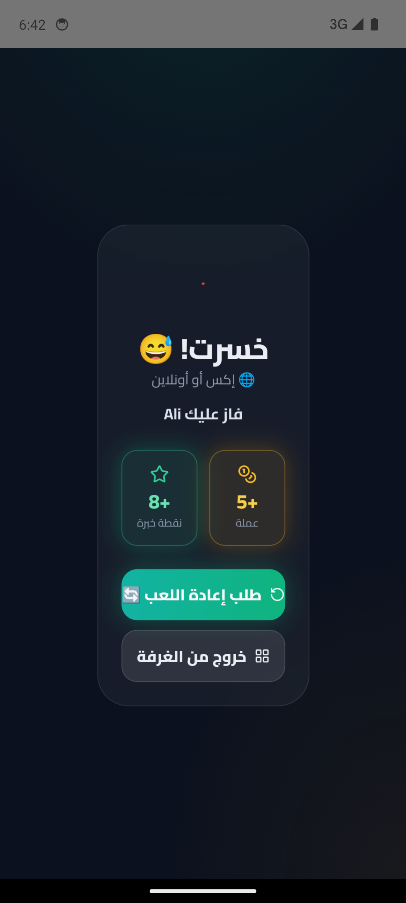

# ديدوس — Dedos 🎮

**منصة ألعاب اجتماعية مصرية بالعربي — العب، اتكلم، واتحدى أصحابك أو لاعبين جدد.**

Dedos is an Arabic-first, RTL social gaming app for Android and the web. It combines polished offline games, realtime multiplayer, direct and group chat, friends, profiles, stats, leaderboards, and native push notifications in one app.

The Android release is currently prepared for Google Play closed testing as **1.11.0 (version code 17)**.

## Screenshots

| شخبطة — الرسام | شخبطة — التخمين | إكس أو أونلاين | النتيجة |
|---|---|---|---|
|  |  |  |  |

## Games

| Game | Offline | Multiplayer |
|---|---|---|
| **إكس أو** ⭕ | Computer or two players | Friend invite or quick match |
| **شطرنج** ♟️ | Computer or two players, three difficulties | Friend invite or quick match, legal-move hints and premoves |
| **لعبة الذاكرة** 🧠 | Easy, medium, and hard boards | Friend invite or quick match |
| **أسئلة ثقافية** 📚 | Large rotating Arabic question bank | Fastest correct answer wins |
| **حلاوة** 🍬 | Animated match-three levels and special pieces | Synchronized competitive board |
| **حجر ورقة مقص** ✂️ | Computer | Friend invite or quick match |
| **سرعة البرق** ⚡ | Reaction-time challenge | Realtime reaction race |
| **الثعبان** 🐍 | Large circular arena | Public drop-in arena with bots, minimap, and leaderboard |
| **سيطر** 🟪 | — | Predictive public territory arena with bots and compact grid updates |
| **كاسحة الألغام** 💣 | Three difficulties | — |
| **أربعة تربح** 🔴 | Computer or two players | Friend invite or quick match |
| **شخبطة** 🎨 | Pass-and-play drawing | Friends, groups, or quick match |
| **بنك الحظ** 🏦 | Computer or local players | Rich realtime Egyptian board game |

Online play no longer uses create-room or join-by-code screens. Players start games through:

- game invites inside a direct or group chat;
- one-tap quick matching with another player;
- the public Snake and سيطر arenas.

## Social experience

- Friend requests must be accepted before two people become friends.
- Compact friends list with live online and currently-playing status.
- Direct and group chat with unread counts, reactions, persistent history, and game invites.
- Native Android notifications for messages and invites; tapping one opens the exact chat.
- Foreground notifications stay inside the app, remain clickable, and do not duplicate the system notification.
- A friendly mandatory Android update prompt blocks outdated builds and directs users to the latest Google Play release.
- Finished game cards show the winner, while pending invites can be reopened after leaving the lobby.
- Player profiles expose game statistics; the leaderboard shows the points used for ranking.
- The home highlight becomes each player's own favourite game after enough plays.
- Game results update coins, XP, levels, play counts, wins, and leaderboard points.

## Performance and Android release

- Games are lazy-loaded so the home screen does not retain every game bundle.
- Bottom navigation preserves mounted sections to avoid reloading on every tap.
- Offline game logic and rich game assets are packaged into the Android bundle.
- Snake uses interpolated rendering, compact snapshots, spatial lookup, client prediction, and a capped public arena.
- سيطر renders and predicts movement on the phone at 60 FPS while the server sends compact territory patches and validates captures.
- حلاوة uses transform-based board animation, optimistic online swaps, GPU compositing, cascades, particles, and special-piece effects.
- Android uses AGP 9, R8 optimization/obfuscation, resource shrinking, release signing, and native-debug metadata configuration.
- Package: `com.dedos.game`; minimum Android API 24; target API 36.

## Tech stack

| Layer | Technology |
|---|---|
| Client | React 19, TypeScript, Vite 7, Tailwind CSS, Framer Motion |
| Android | Capacitor 8, AGP 9, Gradle, JDK 21, R8 |
| Realtime server | Node.js and `ws`, with authoritative competitive-game engines |
| Persistence | SQLite in WAL mode with backup and restore tooling |
| Notifications | Firebase Cloud Messaging and Capacitor Push Notifications |
| Public site | Arabic landing, privacy, and account-deletion pages served by the Node server |

## Project structure

```text
├── src/
│   ├── games/                 # Lazy-loaded local and online games
│   ├── online/                # WebSocket client, matchmaking, presence, social state
│   ├── sections/              # Home, games, chat, friends, profiles, leaderboards
│   └── store/                 # Local profile, settings, stats, coins, and XP
├── server/
│   ├── server.js              # HTTP/WebSocket entry point on port 8787
│   ├── database.js            # Durable SQLite document store
│   ├── competitive-games.js   # Realtime game orchestration
│   ├── snake-arena.js         # Public Snake simulation
│   ├── push-notifications.js  # FCM delivery
│   └── public/                # Landing, privacy, and deletion pages
├── android/                   # Capacitor Android project
├── autostart/                 # Windows server/tunnel supervisor
├── tools/                     # Backup and verification utilities
├── tests/                     # Client logic regression tests
└── docs/                      # Architecture, protocol, development, operations
```

## Local development

Requirements: Node.js 24+, npm, and (for Android) JDK 21 plus Android SDK 36.

```bash
npm install
npm run dev
```

Vite prints the local development URL, normally `http://localhost:5173`.

Run the multiplayer server separately:

```bash
npm run server
```

The server listens on port `8787`. Production Android builds connect to `wss://dedos.adelsamir.com`; emulator development can use `ws://10.0.2.2:8787`.

## Tests

```bash
npm run test:client
npm run test:server
npm run build
```

Focused reliability and multiplayer smoke commands are also available:

```bash
npm run smoke:reliability
npm run smoke:competitive
npm run smoke:snake
npm run smoke:paper
```

## Build the Android App Bundle

Release signing reads the local, gitignored `android/keystore.properties`. Never commit the upload keystore or its passwords.

```powershell
npm run build
npx cap sync android
cd android
.\gradlew.bat bundleRelease
```

The signed, R8-optimized bundle is generated at:

```text
android/app/build/outputs/bundle/release/app-release.aab
```

Each Play Console upload must use a higher `versionCode`. Keep the generated R8 mapping and native debug-symbol files with the matching release so crashes and ANRs can be decoded.

## Push notifications

The Android app ID is `com.dedos.game`. Client configuration lives in `android/app/google-services.json`; server-side Firebase Admin credentials must be supplied through a gitignored service-account file or environment variable. `/health` reports whether push delivery is configured without exposing credentials.

When the app is backgrounded, a message or game invite can appear on the lock screen or as a heads-up notification. When it is foregrounded, Dedos shows one clickable in-app notification instead of duplicating the native banner.

## Public pages and operations

| Route | Purpose |
|---|---|
| `https://dedos.adelsamir.com/` | Egyptian Arabic landing page |
| `https://dedos.adelsamir.com/privacy` | Complete Arabic/English privacy policy |
| `https://dedos.adelsamir.com/delete-account` | Account and privacy-request flow |
| `https://dedos.adelsamir.com/health` | Server, database, and push health |
| `https://dedos.adelsamir.com/api/app-version` | Latest Android release used by the in-app update prompt |

Operational setup, backup verification, restart behaviour, and recovery are documented in [docs/SERVER-OPERATIONS.md](docs/SERVER-OPERATIONS.md).

## Documentation

- [Architecture](docs/ARCHITECTURE.md)
- [WebSocket protocol](docs/PROTOCOL.md)
- [Development guide](docs/DEVELOPMENT.md)
- [Server operations](docs/SERVER-OPERATIONS.md)

## License

Private project — All rights reserved © Adelsamir01.
